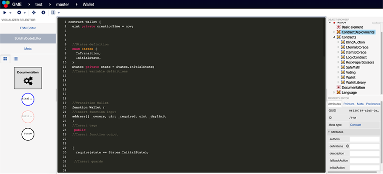
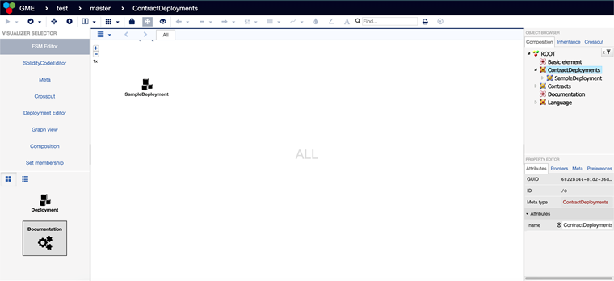
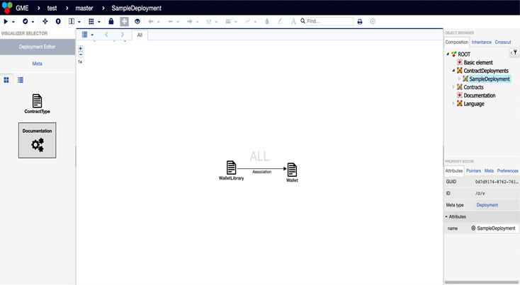
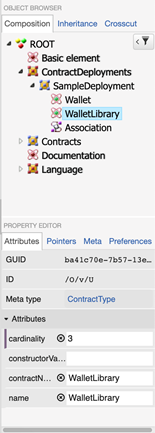
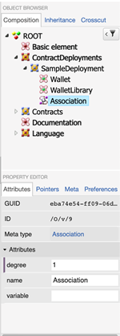
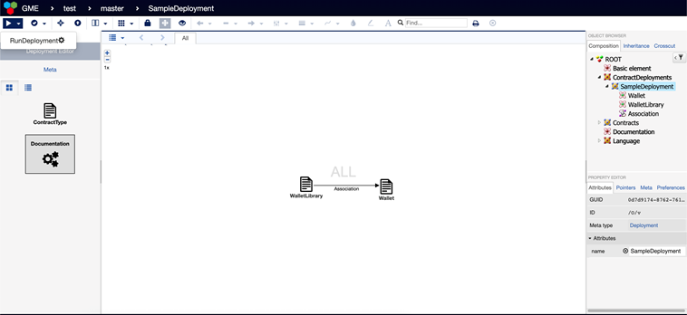
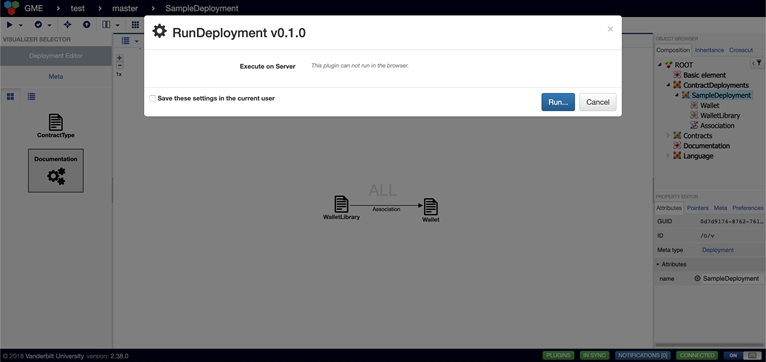
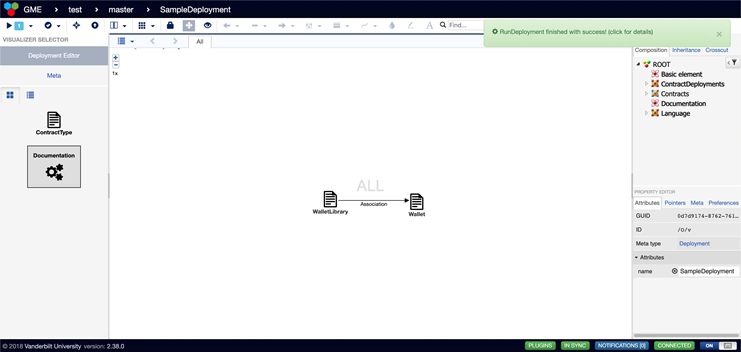
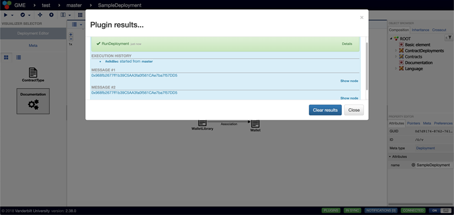

# Verified Development and Deployment of Multiple Interacting Smart Contracts

This repository contains the implementation of the Verified Development and Deployment of Multiple Interacting Smart Contracts framework, which allows designing and generating secure Solidity smart contracts. This framework is built on [WebGME](http://github.com/webgme/webgme). 

## How to install?
First, install the following:
- [NodeJS](https://nodejs.org/en/download/) (v4.x.x recommended)
- [MongoDB](https://www.mongodb.com/download-center#production)

On Ubuntu, you also need to install `npm` and `nodes-legacy` using `apt`.

To clone the repository, first install (if necessary):
- [Git](https://git-scm.com/downloads)

and then clone the repository in your preferred directory, for example:
```
cd /home/$USER
git clone https://github.com/smartcontractsfc/verifier.git
```
This makes the 'project root' for the git repo `/home/$USER/smart-contracts`.

Install packages with npm in the project root (`smart-contracts`):
```
cd /home/$USER/smart-contracts
npm install
npm install webgme
npm install -g bower
bower install
```
Start mongodb locally by running the `mongod` executable in your mongodb installation (you may need to create a `data` directory or set `--dbpath`). For example:
```
cd /home/$USER
mkdir sc_data
mongod --dbpath ./sc_data
```
wait until you see a line that says "[initandlisten] waiting for connections on port 27017".

Then, in a new terminal window, run `npm run dev` from the project root (`smart-contracts`) to start. For example:
```
cd /home/$USER/smart-contracts
npm run dev
```

After the webgme server is up and there are no error messages in the console, open a valid address in the browser to start using the Smart Contracts. The default is http://127.0.0.1:8888/, you should see all valid addresses in the console.

Click `Create New…` to create a new project.
After entering a project name of your choice, import the seed `SC_new` to start working on smart contracts!

IMPORTANT: To use the VerifyContract plugin, please download the nuXmv tool (version 1.1.1) from https://es-static.fbk.eu/tools/nuxmv/index.php?n=Download.Download and just add it in the smart-contracts/verificationTools folder.

## Steps for Deployment 

* Copy solidity code into Solidity Editor. Press Ctrl + S to create the FSM.



* Select ContractDeployments node available in the tree to the right of WebGME.



* Create a new child and name the deployment. Select the new child node and go to the Deployment Editor. In the editor, Contract Types, and their Associations. 



* In the object browser, select contract type will allow you to set the cardinality and constructor values. 



* Select the Association in the object browser to set the degree for the Association. 



* Network information can be provided in ./src/solidityscripts/runsol.js. Under the plugins, RunDeployment plugin can be used to start the deployment. 





* Upon successful deployment a message is displayed with addresses of the deployed contracts. 






